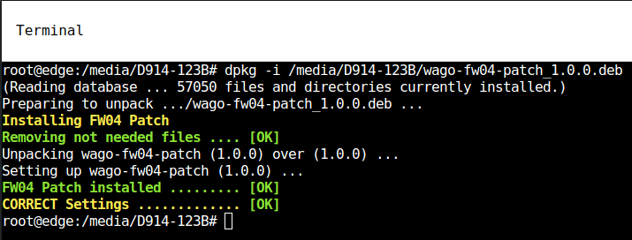

<p align="left">

</p>

## Patches
| Patches | Description |
| ------- | -------- |
| wago-fw04-patch_1.0.0_all.deb | [JUMP](#fw04-01) |

###  How to install a patch:

#### Offline-Mode
 Nedded:  USB disk drive
 1. Check the latest patch for your firmware [PATCHES DIRECTORY](patches)
 2. Download the patch and copy it to the USB drive.
 3. Attach the USB drive to Edge Computer
 4. Open a browser and connect to Cockpit <pre><code>http://IP_OF_EDGE_COMPUTER:9090</code></pre>
 5. Login as:<pre> USER:root PASSWORD:YOUR_PASSWORD</pre>
 6. Click on Terminal
 7. Find USB disk drive <pre><code>dmesg</code></pre>
     You should find something like this:
     ```
     [ 8122.243097] scsi 3:0:0:0: Direct-Access     SanDisk  Cruzer Blade     1.00 PQ: 0 ANSI: 6
     [ 8122.245481] sd 3:0:0:0: Attached scsi generic sg1 type 0
     [ 8122.267272] sd 3:0:0:0: [sdb] 120225792 512-byte logical blocks: (61.6 GB/57.3 GiB)
     [ 8122.269240] sd 3:0:0:0: [sdb] Write Protect is off
     [ 8122.269243] sd 3:0:0:0: [sdb] Mode Sense: 43 00 00 00
     [ 8122.269601] sd 3:0:0:0: [sdb] Write cache: disabled, read cache: enabled, doesn't support DPO or FUA
     [ 8122.276476]  sdb: sdb1
     [ 8122.276716] sd 3:0:0:0: [sdb] Attached SCSI removable disk
     ```
     Here you see ``sdb1`` which is the partition
  8. Mount the partition
     ```
     mount /dev/sdb1 /mnt
     ```
  9. Installing the patch
     ```
     dpkg -i /mnt/PATCH-FILE.deb
     ```
     Example output:
     <p></p>

  10. Clean up
      ```
      umount /mnt
      ```
      Detach the USB disk drive

#### Online-Modus
 1. Open a browser and connect to Cockpit <pre><code>http://IP_OF_EDGE_COMPUTER:9090</code></pre>
 2. Login as:<pre> USER:root PASSWORD:YOUR_PASSWORD</pre>
 3. Click on Terminal
 4. Download the patch
    ```
    cd /tmp
    wget https://github.com/WAGO/edge-firmware/raw/refs/heads/main/patches/wago-fw04-patch_1.0.0_all.deb
    ```
 4. Installing the patch
     ```
     dpkg -i /tmp/PATCH-FILE.deb
     ```
     Example output:
     <p></p>

# Patch description

## <a name="fw04-01"> wago-fw04-patch_1.0.0_all.deb
* This patch will correct the network names after a BIOS update
  

* Detect which hardware version of **752-9800** is used
```
dmidecode -t system | grep Version
```
Output:
```
root@edge:~# dmidecode -t system | grep Version
	Version: 4224040202
```

* Compatibily Matrix

 | Device | Description |
 | ------ | ------ |
 | 752-94xx | Patch not needed! |
 | 752-9800 HW1 | Patch not needed! |
 | 752-9800 HW2 | Needed after BIOS Update |
 | 752-9813 | Needed.|
