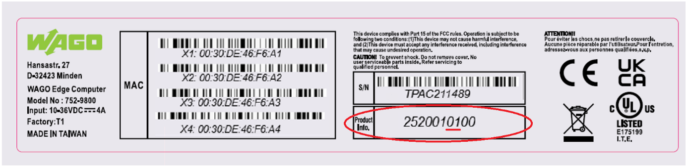

<p align="left">

</p>

## Patches
| Patches | Description |
| ------- | -------- |
| wago-fw04-patch_1.0.0.deb | [JUMP](#fw04-01) |

###  How to install a patch:

#### Offline-Mode
 Nedded:  USB disk drive
 1. Check the latest patch for your firmware
 2. Download the patch and copy it to the USB drive.
 3. Attach the USB drive to Edge Computer
 4. Open a browser and connect to Cockpit <pre><code>http://IP_OF_EDGE_COMPUTER:9090</code></pre>
 5. Login as:<pre> USER:root PASSWORD:YOUR_PASSWORD</pre>
 6. Click on Terminal
 7. Find USB disk drive name
    ``
    cd /media
    ls 
    ``
    Here you see the DEVICE-NAME of the USB disk drive.
 8. Installing the patch
     ```
     dpkg -i /media/DEVICE-NAME/PATCH-FILE.deb
     ```
     Example output:
     <p></p>

 9. Reboot the system
    ```
    reboot
    ```

#### Online-Modus
 1. Open a browser and connect to Cockpit <pre><code>http://IP_OF_EDGE_COMPUTER:9090</code></pre>
 2. Login as:<pre> USER:root PASSWORD:YOUR_PASSWORD</pre>
 3. Click on Terminal
 4. Download the patch
    ```
    cd /tmp
    wget https://github.com/WAGO/edge-firmware/raw/refs/heads/main/patches/wago-fw04-patch_1.0.0.deb
    ```
 4. Installing the patch
     ```
     dpkg -i /tmp/PATCH-FILE.deb
     ```
     Example output:
     <p></p>

 5. Reboot the system
    ```
    reboot
    ```

# Patch Release Notes

## <a name="fw04-01"> wago-fw04-patch_1.0.0.deb
* This patch will correct the network names after a BIOS update
  

* Get "Product Info"
  1. by checking the product label on Edge Computer
     <p></p>

  2. by terminal
     ```
     dmidecode -t system | grep Version
     ```
     Output:
     ```
     root@edge:~# dmidecode -t system | grep Version
         Version: 4224040202
     ```
  3. HowToDecode

     Example Version: 4224040202<br>

     Divide every 2 digits:
     | cw | y | FW-Version | HW-Version | BIOS-Version|
     | :-: | :-:| :-: | :-: | :-: |
     |42|24|04|02|02|


* Compatibily Matrix

  | Device | Description |
  | ------ | ------ |
  | 752-940x | Patch not needed! |
  | 752-9412 | **Needed** |
  | 752-9800 HW1 | Needed if BIOS Version is >= N2.07 |
  | 752-9800 HW2 | **Needed** |
  | 752-9813 | **Needed** |
